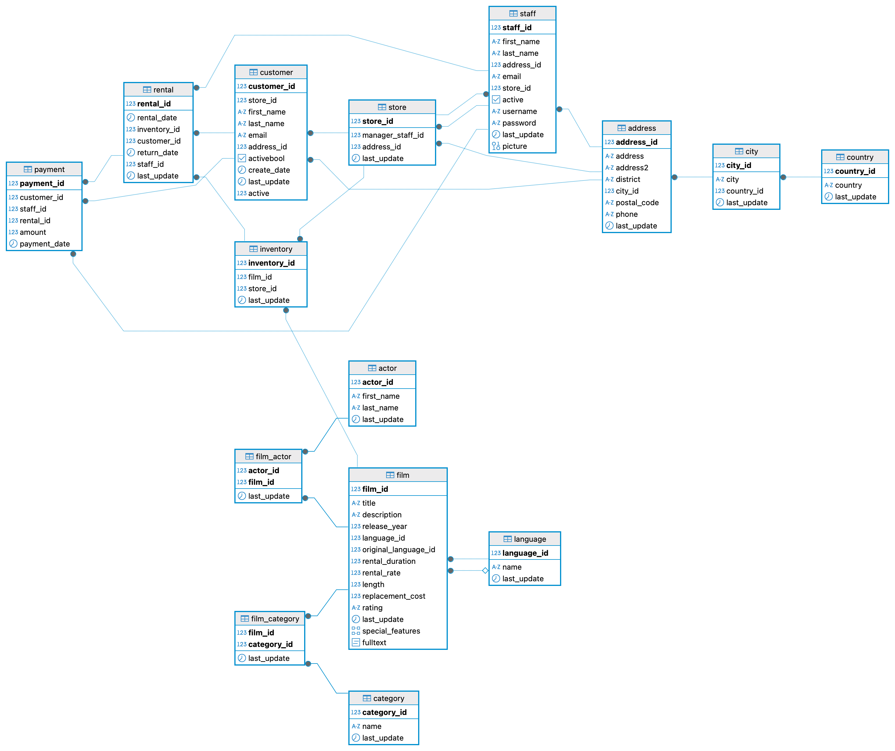

# Tienda de Peliculas

## Descripción del Proyecto
Proyecto de SQL para realizar consultas sobre la base de datos de una tienda de películas.

## Estructura

```bash
DataProject-Lógica. Consultas de SQL
|- EnunciadoDataProject_SQL.Lógica.pdf  # Consultas a realizar en la BBDD de la tienda de peliculas
|- BBDD_Proyecto.sql  # Datos tienda
|- Esquema_Proyecto_SQL.png  # Visualización de las tablas de nuestros datos
|- Proyecto_SQL.sql  # Script con las consultas
|_ README.md
```

## Instalación y pasos

Este proyecto usa PostgreSQL y DBeaver.

Los pasos para realizar el proyecto han sido los siguientes:
- Crear repositorio en GitHub (Tienda-de-películas) para explicar todos los pasos y subir los archivos utilizados para el proyecto final del módulo de SQL.
- Crear la carpeta del proyecto final
- Descargar la base de datos con la que vamos a trabajar y guardarla en la carpeta del proyecto final.
- Ir a Dbeaver, crear nueva base de datos, renombrarla como Proyecto_SQL, establecerla por defecto, buscar archivo denominado, seleccionar base de datos descargada, importar la base de datos, seleccionar toda la base y ejecutar datos, ir a public y darle a renovar. 
- Una vez me aparecen las tablas, ir a public otra vez, darle con el botón derecho y view diagrama. Guardar el esquema de la base de datos en formato .png en la carpeta del proyecto final de este módulo.
- Abrir un nuevo script de SQL y realizar las consultas para dar respuesta a las preguntas planteadas en el archivo anunciado.
- Una vez finalizadas las consultas, exportar script SQL y guardarlo en la carpeta del proyecto final.
- Por último, subir la carpeta con todos los archivos a GitHub.

## Esquema

<div style="text-align: center;">
   
   </div>

## Contribuciones
Las contribuciones son bienvenidas. Si deseas mejorar el proyecto, no dudes en ponerte en contacto conmigo o enviar tus ideas.

## Autores
- Aïna [GitHub Profile](https://github.com/Ainamg)
